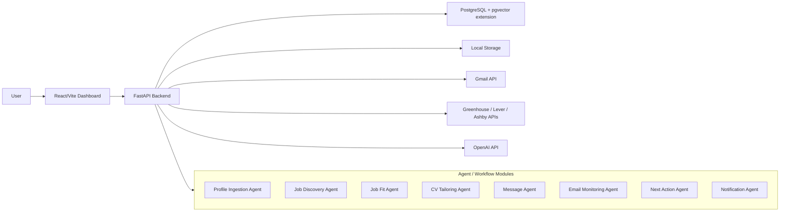

# CareerOps Agent Architecture

CareerOps Agent is a local-first, human-in-the-loop system for higher-quality job applications. It discovers roles, scores fit against a verified candidate profile, prepares tailored CVs/messages, monitors recruiter email, and keeps application actions traceable.

## Core Principles

- No invented experience: generated content must come from user-provided documents, job descriptions, or emails.
- Human approval: CareerOps can draft and recommend, but it must not apply or send email automatically.
- Source traceability: jobs, emails, CV changes, scores, and profile records retain evidence.
- Cost control: cheap models handle classification; stronger models are reserved for profile/CV work.
- LinkedIn safety: CareerOps does not automate LinkedIn login or aggressive scraping. It ingests LinkedIn job alerts and application confirmations through Gmail.
- Google Auth does not grant LinkedIn access. LinkedIn URLs are stored as references only; complete descriptions must come from public ATS sources or manual user input.

## Runtime Components

## Data Model

The database includes the required core entities:

- `companies`
- `jobs`
- `raw_jobs`
- `applications`
- `candidate_profile`
- `profile_sources`
- `profile_skills`
- `profile_projects`
- `profile_experience`
- `profile_education`
- `profile_certifications`
- `documents`
- `raw_emails`
- `emails`
- `job_scores`
- `job_description_resolution_attempts`
- `cv_versions`
- `message_drafts`
- `actions`
- `audit_logs`
- `notification_summaries`
- `semantic_embeddings`

## Agent Responsibilities

| Agent | Current implementation |
| --- | --- |
| Profile Ingestion Agent | Reads provided CV/LinkedIn/template documents, extracts structured profile data, and writes evidence-backed profile records. |
| Job Discovery Agent | Reads public job board APIs and LinkedIn alerts via Gmail, deduplicates jobs, stores raw and normalized records, and only treats LinkedIn alert descriptions as partial metadata. |
| Job Description Resolver | Resolves incomplete jobs through configured Greenhouse, Lever, and Ashby public APIs, applies conservative matching confidence, stores attempts, and requires manual review for uncertain matches. |
| Job Fit Agent | Parses job descriptions, extracts requirements, compares them with verified profile skills, stores score/reasons/risks/evidence. |
| CV Tailoring Agent | Uses the stored LaTeX template and verified profile evidence to create an approval-required tailored CV plan, `.tex`, and PDF. |
| Message Agent | Creates recruiter/application/cover-letter drafts using job score evidence and candidate profile data. |
| Application Tracker Agent | Maintains application state and readiness signals. |
| Email Monitoring Agent | Uses Gmail readonly/compose scopes, normalizes new relevant emails, classifies recruiter/job signals, and can create drafts after approval. |
| Next Action Agent | Derives actions from status, emails, assessments, interviews, rejections, and follow-up timing. |
| Notification Agent | Generates daily summary snapshots for dashboard/console review. |

## Human-in-the-Loop Gates

CareerOps requires user approval before:

- submitting an application,
- treating a CV as final,
- approving a message draft,
- sending or creating Gmail replies beyond an explicit draft request,
- linking uncertain emails to an application.
- accepting uncertain job description matches.

## Source Traceability

- Jobs expose `source`, `source_url`, `raw_payload`, and `source_trace`.
- Jobs also expose description resolution state: `description_status`, `description_quality`, `description_source`, `fetch_status`, `resolved_description_url`, confidence, notes, and resolver attempts.
- Emails expose Gmail IDs, thread IDs, labels, and normalized classification.
- CV versions store `changes`, `tailoring_plan`, generated paths, and source document IDs.
- Profile records store document-backed evidence and source IDs.
- Semantic evidence is stored in `semantic_embeddings` with pgvector and can be retrieved per job.
- Audit logs record major workflow events.

## Job Description Resolver

The resolver is ATS-first and deterministic. It does not use browser automation or LinkedIn credentials. For incomplete jobs, especially `linkedin_email_alert` jobs, it searches only configured public Greenhouse, Lever, and Ashby sources. It scores candidate postings by normalized title similarity, company similarity, location/work-mode compatibility, active/open status, and source reliability.

- `confidence >= 0.90`: accepted automatically.
- `0.70 <= confidence < 0.90`: accepted only with very strong title/company/location agreement; otherwise manual review.
- `confidence < 0.70`: not attached.

Phase 3 keeps the flow conservative when ATS resolution fails. A user can provide an official public URL through `POST /api/v1/jobs/{job_id}/manual-url`; the backend rejects LinkedIn, social/blocked domains, login/auth/session URLs, 401/403 responses, CAPTCHA-like pages, non-HTML content, low-text pages, and pages that do not look like the target role. Successful public pages are saved as `manually_provided_url` or `resolved_from_company_site` with `manual_url` or `company_careers` as the source.

Company careers lookup only tries a small inferred set under the known company website domain and respects `robots.txt` where practical. It does not perform broad crawling, scrape LinkedIn job descriptions, use authenticated scraping, use Selenium, reuse cookies, or bypass bot protection. Medium-confidence candidates stay unattached until the user accepts them in the manual review UI.

Complete description states are `resolved_from_ats`, `resolved_from_company_site`, `manually_provided`, and `manually_provided_url`. Incomplete states are `missing`, `partial_from_email`, and `failed`. `needs_manual_review` belongs to fetch status and resolver attempts; it blocks final scoring, CV tailoring, and message drafting until the user resolves the description.

## Authentication

The local MVP supports optional single-user API key authentication:

- Backend: `APP_AUTH_ENABLED=true` and `APP_API_KEY=...`
- Frontend: `VITE_CAREEROPS_API_KEY=...`

This is enough for a private deployment. A public SaaS version should use full OAuth/session auth.

## Remaining Production Gaps

- Test coverage is started but not exhaustive.
- Cloud deployment requires choosing a provider and setting secrets.
- Public app-level login should replace API-key auth before multi-user use.
